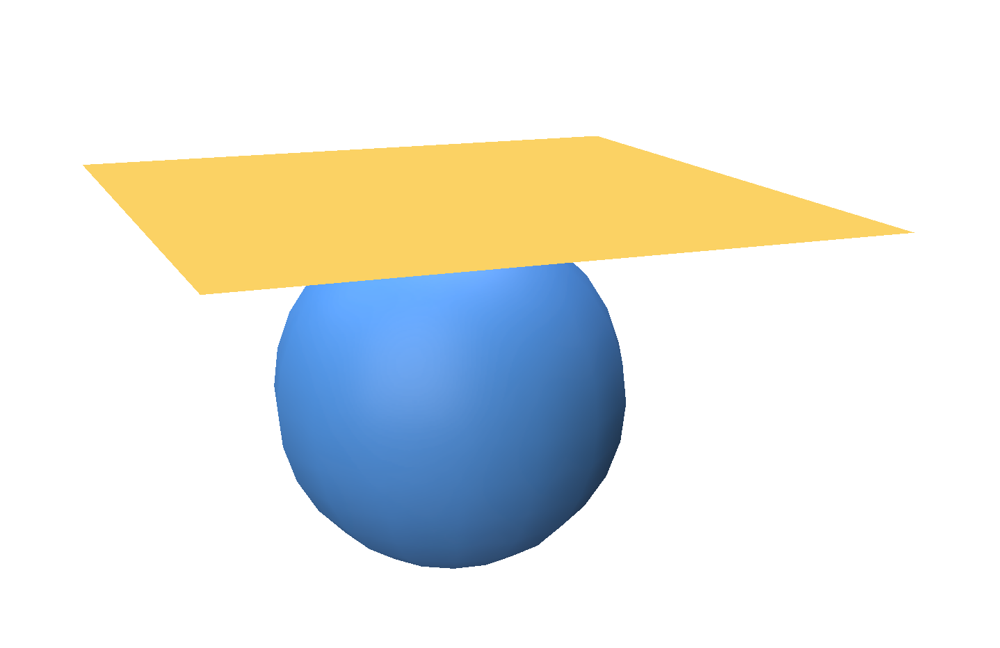

# Robust Skin Weights Transfer via Weight Inpainting

Sample code for the Siggraph Asia 2023 Technical Communications paper - [Robust Skin Weights Transfer via Weight Inpainting](https://www.dgp.toronto.edu/~rinat/projects/RobustSkinWeightsTransfer/index.html)

## Dependencies

Python bindings for [libigl](https://github.com/libigl/libigl-python-bindings)

[Polyscope](https://polyscope.run/py/installing/)

## Running
### Simple Transfer

```python
python src/sphere_to_plane_transfer.py
```

This will perform a simple transfer of weights from a sphere to the plane above it.



However, the code contains the full implementation of the method, and you can swap 
the meshes with any other meshes and load the source skinning weights.

### Body to garment transfer
(Coming soon) Load fbx files of a body and cloth meshes. Do the transfer from 
the body to cloth and write the result of the transfer into another fbx that can 
be loaded in other 3D software (Blender, Unreal, etc.).

## Other 3rd party implementations
Blender addon (by Sent From Space) - https://jinxxy.com/SentFromSpaceVR/robust-weight-transfer

## Cite
If you use this code for an academic publication, cite it as:
```bib
@inproceedings{abdrashitov2023robust,
author = {Abdrashitov, Rinat and Raichstat, Kim and Monsen, Jared and Hill, David},
title = {Robust Skin Weights Transfer via Weight Inpainting},
year = {2023},
isbn = {9798400703140},
publisher = {Association for Computing Machinery},
address = {New York, NY, USA},
url = {https://doi.org/10.1145/3610543.3626180},
doi = {10.1145/3610543.3626180},
booktitle = {SIGGRAPH Asia 2023 Technical Communications},
articleno = {25},
numpages = {4},
location = {<conf-loc>, <city>Sydney</city>, <state>NSW</state>, <country>Australia</country>, </conf-loc>},
series = {SA '23}
}
```
